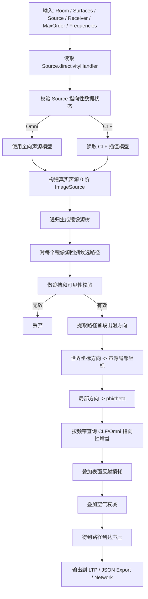
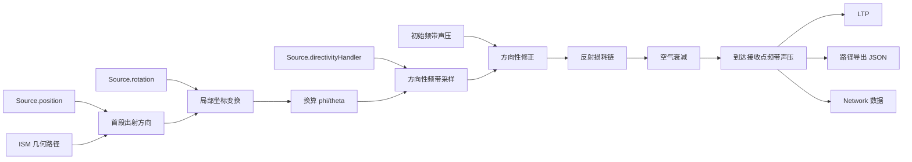

# Image Source 并入指向性的概念方案

## 1. 背景

当前项目中的 `Image Source Method` 已具备镜像源树生成、有效路径构造、到达时刻计算、路径导出等能力。项目中也已存在声源指向性相关能力，主要体现在 `Source.directivityHandler` 与 `CLFParser` 的数据链路上。

现状问题是：

- `Image Source Method` 当前只计算几何路径、反射损耗和空气衰减
- 声源指向性尚未进入 `Image Source Method` 的路径声压结算过程
- 现有实现里接收器指向性没有形成成熟主链

因此本轮改造的目标是：在不破坏现有镜像源几何求解链路的前提下，把声源指向性并入 `Image Source Method` 的路径声压计算。

## 2. 目标

- 将声源指向性增益纳入 `Image Source Method` 的路径级频带声压计算
- 保持现有镜像源树和路径可见性算法基本不变
- 为后续调试、导出和回归测试提供可观测的方向信息
- 使 `Omni` 与 `CLF` 两类声源都能通过统一入口参与 `Image Source Method`

## 3. 首版边界

- 首版只处理“声源指向性进入 ISM”
- 接收器仍按全向接收处理
- 反射面继续沿用现有镜面反射与吸收模型
- 不在本轮引入 BRDF、散射或接收端极图

## 4. 总体设计原则

- 几何链路与声学修正解耦
- 先保路径正确性，再加方向性修正
- 所有角度换算只保留一个统一入口
- 输出链路尽量追加字段，不随意破坏现有结构
- 测试先行，逐功能点门禁推进

## 5. 计算流程图

## 6. 信号线路图

## 7. 关键实现设计

### 7.1 保持 ISM 几何层不变

- `computeImageSources()` 继续负责镜像源树生成
- `constructImageSourcePath()` 继续负责路径回溯与反射点构造
- 指向性不进入镜像源树的递归逻辑

### 7.2 在路径层补入方向信息

路径层新增能力：

- 提取首段出射方向
- 将世界方向向量转换到声源局部坐标
- 将局部方向换算为 `phi/theta`
- 供 `DirectivityHandler` 查询频带方向增益

### 7.3 在 `arrivalPressure()` 中接入指向性

原有路径声压结算流程：

- 初始 SPL 转压力/强度
- 表面反射损耗
- 空气衰减

改造后的流程：

- 初始 SPL 转压力/强度
- 叠加声源方向性修正
- 叠加表面反射损耗
- 叠加空气衰减

### 7.4 统一角度约定

- 建立统一的“世界方向 -> 声源局部 `phi/theta`”换算函数
- ISM 后续所有方向采样统一走这一个入口
- 减少 `theta/phi` 与不同坐标系定义冲突的风险

### 7.5 增强输出链路

路径导出建议追加以下信息：

- `emissionDirectionWorld`
- `emissionDirectionLocal`
- `emissionPhi`
- `emissionTheta`
- `sourceDirectivityPerBand`

## 8. 输出链路影响

- `LTP` 可以继续沿用当前结果结构
- `JSON Export` 应补充方向性字段
- `Network` 数据可以复用新增的方向性字段
- 调试期应保留“方向修正前/后”的可观察信息

## 9. 测试原则

- 单元测试统一管理
- 每个功能点实现后必须测试通过
- 当前阶段测试不通过，不进入下一阶段
- `Omni` 模式必须作为回归基线
- `CLF` 模式必须验证方向差异确实进入路径结算

## 10. 已确认约束

- 先建设并统一管理单元测试
- 每个功能点开发后必须先测试通过，再进入下一步
- 全程维护开发文档与日志
- 严格避免乱码和编码混乱
- 首版只处理声源指向性进入 ISM
- 接收器指向性暂不进入本轮主链
